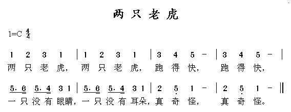

# .mif文件生成器

为使用Quartus II设计的蜂鸣器乐曲播放器设计，以更便捷、直观的文件编写方式生成ROM核所需的乐曲谱面.mif文件。

[](https://www.oracle.com/technetwork/java/javase/downloads/jdk13-downloads-5672538.html)
[](https://www.jetbrains.com/idea/)
[](LICENSE)

## 使用说明

**本工程需要自行下载或克隆仓库后自行编译运行。**

项目规定了一种新的乐谱音符表示方法，能大幅简化音符输入的表示。

### 输入格式

&nbsp;&nbsp;&nbsp;&nbsp;项目中的 `input` 文件为程序的输入部分。

&nbsp;&nbsp;&nbsp;&nbsp;文件内容与所演奏的乐谱对应，共支持低音、中音和高音三个音域的音符，其对应写法如下（以音符do为例）：

|低音1|中音1|高音1|中音1（模仿古筝摇指）|
|---|---|---|---|
|01|1|11|1/|

|十六分音符|八分音符|四分音符|二分音符|全音符|
|---|---|---|---|---|
|..1|.1|1|1-|1---|

|八分音符附点|四分音符附点|二分音符附点|
|---|---|---|
|.1.|1.|1---|

_最短音符时长仅支持至十六分音符。_

#### 例如
《两只老虎》简谱为：


其 `input` 文件输入内容为:
    
    1
    2
    3
    1
    
    1
    2
    3
    1
    
    3
    4
    5-
    
    3
    4
    5-
    
    .5.
    ..6
    .5.
    ..4
    3
    1
    
    .5.
    ..6
    .5.
    ..4
    3
    1
    
    2
    05
    1-
    
    2
    05
    1-

### 输出格式

&nbsp;&nbsp;&nbsp;&nbsp;项目中的 `output` 文件为程序的输出部分，即生成完整的.mif文件内容，导出生成.mif文件即可直接使用。

### 部分代码说明
```java
// 调性转换
private final int offset = 0;
```
变量 `offset` 的作用是对谱面进行调性转换，工程中其值为0，即不进行调性转换。如果希望对谱面进行调性转换，需要自行计算 `offset` 的值。

例如：原谱为F调，则原谱中的 `1` 音对应的绝对音高为 `4`，故 `offset` 值应设置为 `3`。

经过调性转换后，务必将 Quartus II 工程中处理蜂鸣器音高的部分进行修改。

例如：F调中 `7` 音为 `♭7`，故需要将蜂鸣器中 `7` 音的频率改为 `♭7` 音的频率。其余调性同理。

```java
// 以几分音符为一个音符单位
private final int unit = 16;
```

变量 `unit` 的作用是设定生成的.mif文件内容以几分音符为乐谱的基本单位，工程中 `unit` 的值为 `16`。